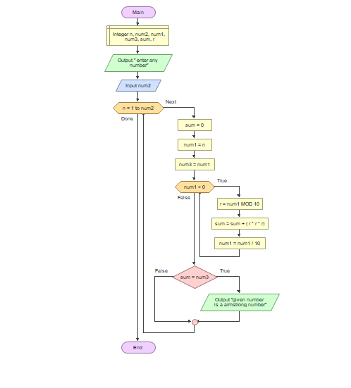

># PsuedoCode for Armstrong numbers!
* BEGIN
* READ n
* temp=n
* sum=0
* WHILE n>=0
    sum=sum+(n%10)*(n%10)*(n%10)
    n=n/10
* ENDWHILE
* IF sum==temp
    OUTPUT "NUMBER IS AN ARMSTRONG NUMBER"
ELSE
* OUTPUT"NUMBER IS NOT AN ARMSTRONG NUMBER"
END

